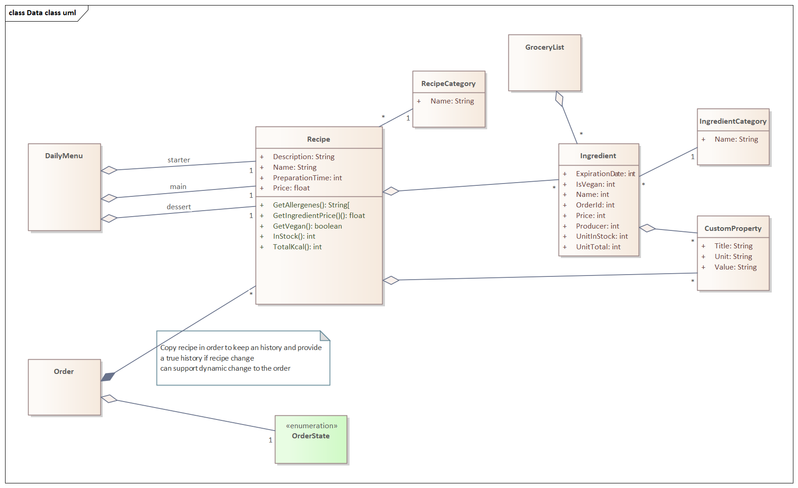
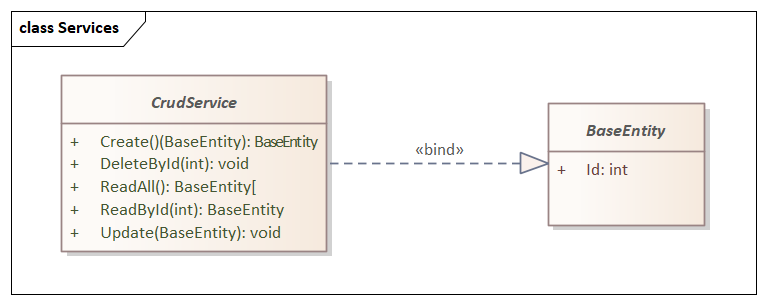

# Digitalisation du millieux de la restauration

## Team : A-10 
Notre super équipe 👨‍💻

| Qui ?              | Role                      | Email                         |
| ------------------ | ------------------------- | ----------------------------- |
| Corentin Zeller    | Chef de projet            | corentin.zeller@heig-vd.ch    |
| Wènes Limem        | Remplaçant chef de projet | wenes.limem@heig-vd.ch        |
| Soulaymane Lamrani | Responsable domain métier | soulaymane.lamrani@heig-vd.ch |
| Matthieu Godi      | Responsable qualité       | matthieu.godi@heig-vd.ch      |

## Processus de développement

[Lien sur le document](./developement_guide/04_contribution_guide.md)

## Languages & Frameworks  👨‍🏭

 -ASP.NET CORE de © Microsoft avec le langage C#  
 -Blazor, pour la création de l’interface Web, qui est aussi en C# et basé sur le dot net core  
 -Html/css/js pour la partie utilisateur  

## Architecture 📝

La structure des classes de données (proposition):

Afin de généraliser l'utilisation des données dans les pages l'idée serait de faire un service de type CRUD (Create, Read, Update, Delete) de facon générique sur nos données.

Ceci permet d'heriter du crudService pour chaque entité que l'on souhaite utiliser dans l'application. Si l'on veut modifier ces fonctions cela restera donc possible.

## Tools & Links :  🧲

 - Project Management (old): Monday.com https://goldenfish-team.monday.com/boards/1131125508 "PRO PROJECT BOARD"
 - Charts & Diagrams  : LucidChart.com [link] https://lucid.app/lucidchart/invitations/accept/492f8309-5489-4a34-a2bd-6df0d30ca325
 - charts https://elegant-lichterman-ac3758.netlify.app/
 - Interface & UI     : Figma.com [link] https://www.figma.com/file/MO6bg34RGfaSVGcBIAXyvm/EkoRestaurant
 - Présentation intemédiaire:  GDrive [link] https://docs.google.com/presentation/d/1ly3ljTkGpUxOc5H364G4JnFolfno5Q0mIRcQboQwFOo/edit#slide=id.gcd4f631cc5_0_5

